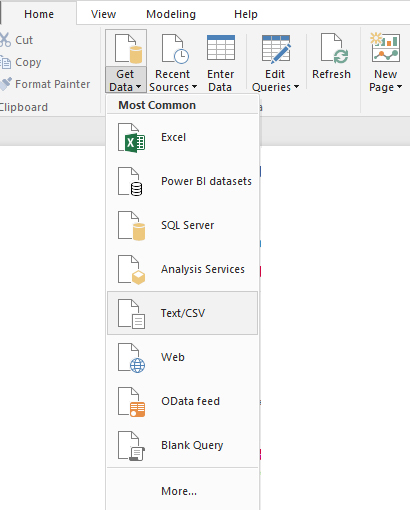
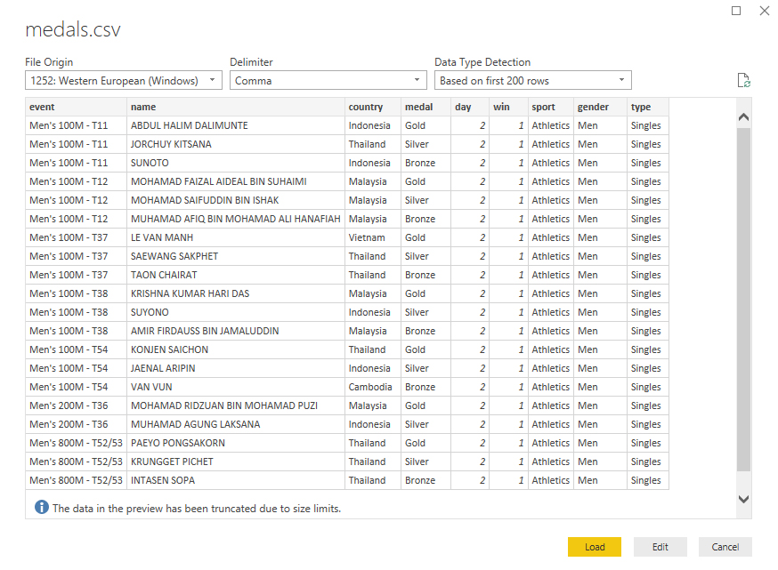

## Creating a multi-sports event dashboard in Microsoft PowerBI ##

This demo will provide an introduction in  
- loading flat files (.csv) into PowerBI 
- creating New Measures in PowerBI
- creating custom sorting order in PowerBI
- creating different visualisations to build a dashboard 

The data used are pre-scraped from the 8th Asean ParaGames website using the free tier of [import.io](https://www.import.io/)  

### Part 1: Inserting Data ###

Load the flat files into PowerBI by clicking on "Get Data" > "Text/CSV" > and select "medals.csv".

On the preview window click on the "load" button to import the data into PowerBI

