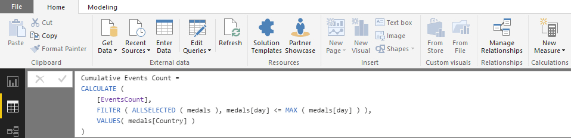

## Creating a multi-sports event dashboard in Microsoft PowerBI ##

This demo will provide an introduction in  
- loading flat files (.csv) into PowerBI 
- creating New Measures in PowerBI
- creating custom sorting order in PowerBI
- creating different visualisations to build a dashboard 

The data used are pre-scraped from the 8th Asean ParaGames website using the free tier of [import.io](https://www.import.io/)  

### Part 1: Inserting Data - medals.csv ###

Load the flat file data into PowerBI by clicking on "Get Data" > "Text/CSV" > and select "medals.csv".
The medals.csv data contains all the information scrapped from the 8th Asean ParaGames websites containing the event name, player name, country, medal type, day of the event, genre of the sport, gender, and the sport type (team or single). 

On the preview window click on the "load" button to import the data into PowerBI

### Part 2: Inserting Data - medalSort.csv ###

Repeat the steps in **Part 1** and import the medalSort.csv data into PowerBI
The medalSort.csv data contains the data to perform custom sorting in PowerBI. PowerBI could not understand the sort order of the medal type. For example Gold is > than Silver > than Bronze therefore we need to specify a custom sorting order.

Navigate to the **Relationship Viewer** last tab on the left hand panel to see the relationship between the two loaded dataset

### Part 3: Creating New Measures ###

Four new measures needs to be created in order to present the information in the final dashboard
- total event count
- total medal count
- cumulative event count
- cumulative medal count 

Navigate to the **Query Editor** middle tab on the left hand panel and add the four new measures to the medal dataset as shown below:

**total event count**

**total medal count**

**cumulative event count**

**cumulative medal count**

### Part 4: Building Visualisations for Dashboard ###

The different types of visualisations used to build the dashboard are:
- silcer
- cards
- piechart
- table
- filled map
- scatter plot

Navigate to the **Report** first tab on the left hand panel and add the different visualisations to the dashboard canvas:

**slicer visualisation**
Drag the slicer visualisation onto the canvas to act as a filter. Next drag 'sport' from the field panel to the slicer Field in the visualisation panel. This creates a filter based on the different genre of sports. 

Create another two sets of filter using the 'genre' and 'type' data column

**cards visualisation**
Drag the cards visualisation onto the canvas. Add 'Country' to the cards Field, next click on the added 'Country' data and select 'Count (Distinct)' to show the number of unique countries taking part in this sporting event. 

Repeat the above steps and for displaying the number of different sports involved and competitve events

**piechart visualisation**
Drag the piechart visualisation onto the canvas. Add 'gender' to the piechart Legend and 'event' to the piechart Values, click on the added 'event' data and select 'Count (Distinct)'

**table visualisation**
Drag the table visualisation onto the canvas. Add 'Country' to the table Rows, 'medal' (from the medals dataset) to the Columns and 'medal count' to the Values

**filled map visualisation**
Drag the filled map visualisation onto the canvas. Add 'Country' to the filled map Location, and 'medal count' to the Color saturation

**scatter plot visualisation**
Drag the scatter visualisation onto the canvas. Add 'Country' to the scatter Details, 'Cumulative Medals Count' to the X Axis, 'Cumulative Events Count' to the Y Axis, and 'Cumulative Medals Count' to the Size

**Animation of the medal counts by country by day**

### Final Dashboard ###

